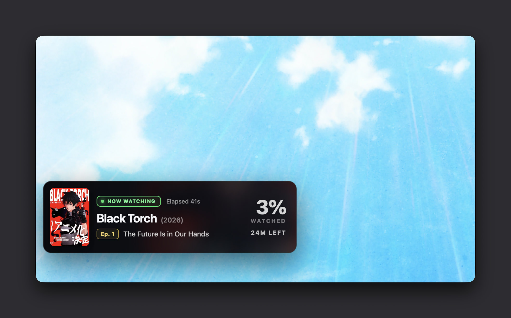
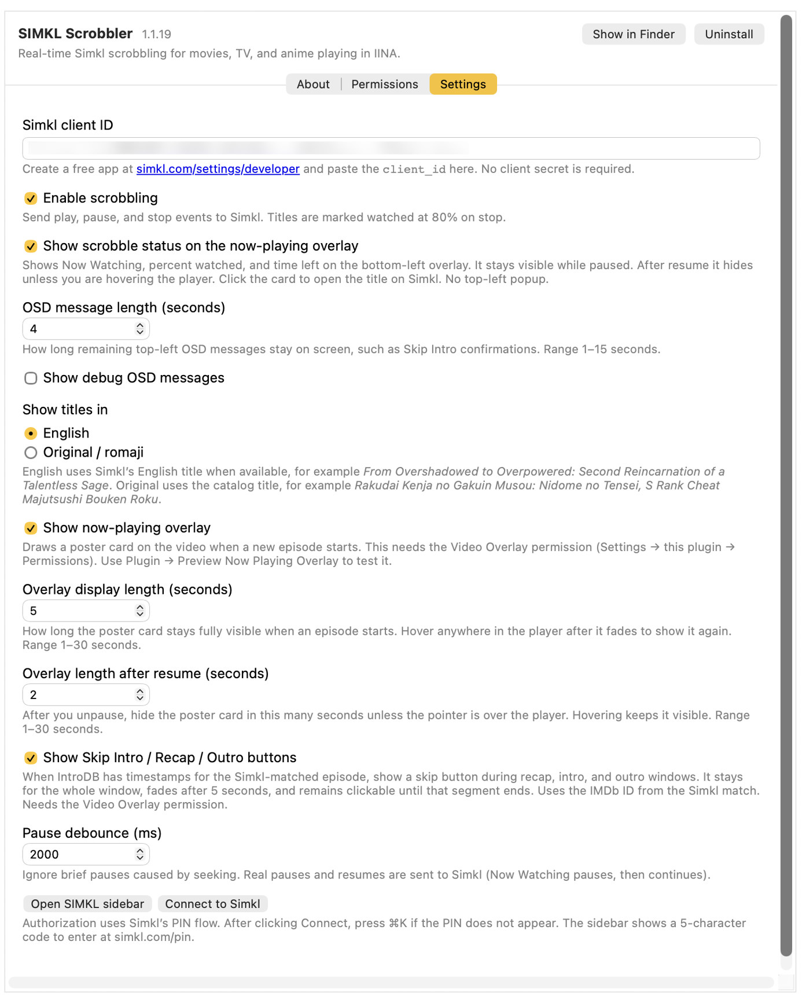

# SIMKL Scrobbler for IINA

An [IINA](https://iina.io) plugin that scrobbles movies, TV, and anime to [Simkl](https://simkl.com) in real time, with a now-playing overlay and skip buttons from IntroDB or file chapters.

Requires **IINA 1.4.0** or later.



The overlay shows the matched title, live progress, and time left. Episode chips match Simkl: **S01E01** for TV, **Ep. 9** for anime, nothing for movies. Click the card to open the title on Simkl. Hover anywhere in the player after it fades to bring it back. Plugin settings choose the card corner (Top-Left, Bottom-Left, Top-Right, Bottom-Right, or Top-Center) and a pixel inset. Skip Intro / Recap / Outro / Preview stays in the bottom-right, and only moves to the bottom-left when the card is also bottom-right.

## Install

In IINA, open **Settings → Plugins → Install from GitHub** and enter:

```
prestinesnail/iina-simkl-scrobbler
```

IINA installs from [github.com/prestinesnail/iina-simkl-scrobbler](https://github.com/prestinesnail/iina-simkl-scrobbler) and can check that repository for updates.

For local development, symlink the plugin folder:

```sh
mkdir -p ~/Library/Application\ Support/com.colliderli.iina/plugins
ln -sf "$(pwd)" ~/Library/Application\ Support/com.colliderli.iina/plugins/iina-simkl-scrobbler.iinaplugin-dev
```

Restart IINA. The plugin appears under **Settings → Plugins**. Quit IINA fully before replacing an existing install.

## Setup

1. Click **Connect to Simkl** in plugin settings, or open the **SIMKL** sidebar (`⌘K`) and click **Connect**.
2. Approve access in the browser window that opens (`https://simkl.com/oauth2/authorize`). After you allow it, a local page at `http://127.0.0.1/callback` confirms you can return to IINA.

If you connected with an older plugin build, connect once more. Watch history stays on Simkl. Search, scrobble, and catalog lookups all use your signed-in token.

The access token and refresh token are stored in the macOS keychain. A plaintext copy is written to plugin preferences and the plugin data folder only if the keychain write fails; successful keychain storage deletes those copies. Access tokens last 7 days and are refreshed automatically; the refresh token lasts 180 days while you keep using the plugin. Sign-out revokes the grant. You can also remove the app in [Simkl Connected Apps](https://simkl.com/settings/connected-apps/).



IINA will ask you to approve two “dangerous” permissions. They are required for scrobbling to work.

## Permissions

### Access the file system

IINA groups disk access and `utils.exec` under this permission. The plugin uses it for:

- **Plugin data folder (`@data`)** — match cache and a 30-minute “no match” cache so the same file is not re-identified every play. If the macOS keychain write fails, a fallback copy of the OAuth token is stored here and in plugin preferences; it is deleted when keychain storage succeeds.
- **Plugin temp folder (`@tmp`)** — short-lived curl header and JSON body files (mode 0600) so the Bearer token is not passed on the process command line.
- **`/usr/bin/curl`** — JSON POST bodies (scrobble, file search). IINA’s HTTP helper form-encodes objects, which Simkl rejects.
- **`/bin/chmod`** — restrict those temp files to the current user.
- **`/usr/bin/python3`** — PKCE challenge and a short-lived `127.0.0.1` callback server for Simkl’s browser sign-in.
- **`osascript`** — copy the sign-in link to the clipboard when you click Copy.

The plugin does not scan your library. It only sees the path of the file IINA is already playing, and it never sends file contents—only a filename (and optionally `parent/filename`) to Simkl.

### Network request

Traffic is limited to the hosts in `Info.json` `allowedDomains`:

| Host | Why |
| --- | --- |
| `api.simkl.com` | Token exchange, file/title search, metadata, and `start` / `pause` / `stop` scrobbles |
| `api.introdb.app` | Recap / intro / outro timestamps for Skip Intro |
| `simkl.com` | OAuth consent (`/oauth2/authorize`) and “View on Simkl” / overlay click (https only) |
| `simkl.in` | Official poster files |
| `wsrv.nl` | Simkl-recommended image proxy: resize, cache, and `&q=90` for overlay and sidebar posters |

Nothing else is contacted.

The overlay and Skip Intro buttons also need **Video Overlay**. On-screen messages use **Show OSD**. Those are not in the red warning list.

## How to use

Play a movie or episode in IINA. The plugin identifies the file, sends Simkl `start` / `pause` / `stop` events as you watch, and draws the now-playing card on the video.

| You do this | What happens |
| --- | --- |
| Play a matched file | Simkl **Now Watching** starts; overlay appears |
| Pause | Simkl saves a resume point and pauses Now Watching |
| Resume | Simkl starts again at the current progress; overlay shows briefly |
| Scrub / skip | Local overlay updates immediately. If the jump is large, a new Simkl `start` or `pause` is sent after the 20s lock so **Watching now** is not stuck interpolating from the old position |
| Stop, close the window, quit IINA, or play the next file | Simkl `stop` — watched if progress is **80% or higher** |
| Let the file end (≥ 95%) | Simkl `stop` at 100% |
| Hover the player after the overlay fades | Overlay peeks back in |
| Click the overlay card | Opens the title on Simkl |
| Skip Intro / Recap / Outro / Preview | Seeks to the end of that IntroDB or file-chapter segment |
| Intro or outro playing | Volume ducks to the setting percent (default 75%), then restores |

If the wrong title is matched, open the sidebar (`⌘K`) and use **Correct match**. **Mark as Watched** in the plugin menu sends `stop` at 100% for the current title.

Simkl marks an item **watched** only on `stop` with progress ≥ 80. Pausing at 90% saves a resume point; it does not complete the watch.

Playback POSTs happen on play, pause, stop, close, natural end, and after a **large seek** once Simkl’s 20-second lock allows — never on a heartbeat timer. Small scrubs still wait for the next pause or stop. A playlist advance is one `stop` for the finished episode, then one `start` for the next — not overlapping lookups or extra 409 stops. Simkl interpolates **Watching now** progress from the item runtime between those events. See [Simkl’s scrobble guide](https://api.simkl.org/guides/scrobble.md).

## How a video is identified

The plugin never hashes the file. It identifies from the **path and filename** IINA is playing.

1. **Filename** — taken from the local path or `file://` URL. For some stream URLs, a `#/` filename hint is used instead of the CDN path. Scene tags (`[BluRay-1080p]`, `{imdb-tt…}`, `-GROUP`) are stripped before matching.
2. **External IDs** — `{imdb-tt0126029}`, `{tmdb-…}`, and `{tvdb-…}` in the file or parent folder are resolved with `GET /redirect` (Location header only; the 301 is not followed), then the catalog record. Later episodes of the same show reuse that show-level cache (episode number still comes from the filename) so a playlist advance is `stop` then `start`, not another redirect. File and title search need a connected Simkl account.
3. **Cache** — a trusted previous match for that file is reused. The show-level record is also reused across episodes that share an IMDb/TMDB/TVDB/Simkl ID. Failed matches are remembered for 30 minutes so a missing title is not re-queried every play. Network errors are not cached as “no match.”
4. **Simkl file search** — `POST /search/file` with a cleaned `Title (Year).mkv`, then the raw basename and parent folder. Folder prefixes from your home directory are not sent.
5. **Trust check** — the result must have a real catalog title and a Simkl ID. Garbage titles (`.`, empty, punctuation-only) are ignored.
6. **Metadata** — `GET /movies/{id}`, `/tv/{id}`, or `/anime/{id}` fills English/romaji titles, year, poster, and extra IDs.
7. **Title-search fallback** — if file search fails, the plugin parses a title (and year / `SxxExx`) from the filename or parent folder and searches Simkl’s catalog. Short tokens such as “One” or “Love” are not trusted as the first catalog hit. A match is kept only when the normalized titles are exact, or word overlap is high **and** the year matches.
8. **Manual override** — **Correct match** in the sidebar searches movies, TV, and anime and stores your choice.

Episode numbers come from the filename (`S01E03`, `1x03`, anime `E01`) when Simkl returns a show without an episode. Movies use the `movie` wrapper. Regular TV uses `show` plus `episode.season` / `episode.number`. Anime uses the `anime` wrapper: MAL / AniDB / AniList-style IDs send a flat episode number; IMDb / TMDB / TVDB IDs also send season so Simkl can map cours.

For sequel seasons that Simkl stores as season 1 of a new series, the overlay can show the filename season (for example `S02E06`) while the scrobble still uses Simkl’s season/episode IDs.

## IntroDB and file chapters

Skip buttons prefer [IntroDB](https://introdb.app) timestamps. They do not come from Simkl.

After a file is matched, the plugin reads the **IMDb ID** on that Simkl record and requests recap, intro, and outro timestamps:

```
GET https://api.introdb.app/segments?imdb_id=tt…&season=…&episode=…
```

Season and episode are the numbers shown on the overlay (filename season when that differs from Simkl’s sequel numbering). Movies and matches without an IMDb ID skip the IntroDB request.

If IntroDB has no times for the episode (or there is no IMDb ID), the plugin reads **chapters in the playing file** and treats OP / Opening / Intro as intro, ED / Ending / Credits as outro, Recap / Previously as recap, and Preview / Next Episode as preview. Story chapters such as Prologue, Part A, and Part B are left alone. The sidebar lists those ranges and notes that they came from file chapters.

When playback enters a segment (with a 1.5s lead-in), a **Skip Recap**, **Skip Intro**, **Skip Outro**, or **Skip Preview** button appears. It fades after 5 seconds and stays clickable until that segment ends. Clicking seeks to the segment’s end. The now-playing card then shows **Skipped Intro** (or Recap / Outro / Preview) instead of a top-left OSD, so it does not cover a top-left overlay. Turn skip buttons off with **Show Skip Intro / Recap / Outro buttons** in plugin settings. They also need the Video Overlay permission.

**Duck volume during intro and outro** (on by default) lowers IINA’s volume to a percent of the current level while an intro or outro is playing — default **75%** — then restores the previous volume when that segment ends. Recap and preview are not ducked. If you change volume while it is ducked, that new level is kept instead of restoring. The percent is in plugin settings.

## APIs and hosts

The plugin only talks to hosts listed in `Info.json` `allowedDomains`.

### Simkl — `https://api.simkl.com`

| Call | When |
| --- | --- |
| Browser `https://simkl.com/oauth2/authorize` | Open Simkl consent with PKCE (`media:read media:write`) |
| Local `http://127.0.0.1:{port}/callback` | Receive the authorization `code` (port is chosen at runtime) |
| `POST /oauth2/token` | Exchange the code (and later refresh the 7-day access token) |
| `POST /oauth2/revoke` | Sign-out |
| `GET /users/settings` | Load the connected account |
| `POST /search/file` | Identify the playing file |
| `GET /redirect` | Resolve `{imdb-tt…}` / `{tmdb-…}` / `{tvdb-…}` tags; read `Location`, do not follow |
| `GET /search/movie`, `/search/tv`, `/search/anime` | Title-search fallback and Correct match |
| `GET /movies/{id}`, `/tv/{id}`, `/anime/{id}` | Titles, poster, year, extra IDs |
| `POST /scrobble/start` | Play or resume |
| `POST /scrobble/pause` | Pause (resume point) |
| `POST /scrobble/stop` | Stop, close, quit, or finished |

Every Simkl API call includes the plugin’s `client_id`, `app-name`, and `app-version`, and sends `Authorization: Bearer` from the keychain. Connect before identifying or scrobbling. JSON POST bodies go through curl so they are sent as JSON (IINA’s HTTP helper form-encodes objects).

Requests are sent one at a time. POSTs wait at least 1 second apart. A `429` with `rate_limit` is retried after about a second; a daily `user_limit_exceeded` is not retried. `400 RATE_LIMIT` is Simkl’s 20-second write lock, not a quota error.

The plugin maps IINA/mpv events onto those scrobble calls. It does **not** poll Simkl for progress.

### IntroDB — `https://api.introdb.app`

| Call | When |
| --- | --- |
| `GET /segments` | Recap / intro / outro times for the matched IMDb episode |

### Images and pages

| Host | Use |
| --- | --- |
| `https://simkl.in` | Official poster art |
| `https://wsrv.nl` | Resize/proxy those posters (`_m` / `_c` + `&q=90`) for the overlay and sidebar |
| `https://simkl.com` | OAuth consent, title pages, and “View on Simkl” (https only) |

No other sites are contacted. The plugin does not send the file contents, only a filename (and optionally `parent/filename`) to Simkl.

## Preferences

| Setting | Default | Meaning |
| --- | --- | --- |
| Enable scrobbling | on | Master switch for Simkl POSTs |
| Show scrobble status on overlay | on | Now Watching / Updating / Paused on the card |
| OSD message length | 4 seconds | Skip confirmation on the now-playing card, and remaining top-left OSD (1–15s) |
| Show debug OSD | off | Extra identification messages |
| Show titles in | English | English or original/romaji in the sidebar and overlay |
| Show now-playing overlay | on | Poster card when a title starts |
| Overlay display length | 8 seconds | How long the card stays fully visible at start (1–30) |
| Overlay length after resume | 2 seconds | Hide delay after unpause unless the pointer is over the player (1–30) |
| Overlay position | Bottom-Left | Poster card corner: Top-Left, Bottom-Left, Top-Right, Bottom-Right, or Top-Center |
| Overlay offset | 24 px | Inset from that edge (0–240). Skip Intro stays bottom-right unless the card is there |
| Show Skip Intro / Recap / Outro | on | IntroDB skip buttons, or OP/ED chapters in the file when IntroDB has none |
| Track rewatches | off | On `stop` ≥ 80% of an already-finished title, log a separate viewing. Simkl Pro / VIP only. Never sent on play or pause |
| Pause debounce | 400 ms | Ignore brief pauses from seeking (0–5000) |

Changes apply while the player window is open.

## Plugin menu

- **Show SIMKL Sidebar** — `⌘K`
- **Connect to Simkl**
- **Toggle Scrobbling**
- **Mark as Watched** — `stop` at 100% for the current title
- **Preview Now Playing Overlay** / **Preview Skip Intro** — layout checks

## Releasing

Push a version tag. GitHub Actions packages the `.iinaplgz` and creates the GitHub release.

```sh
# bump Info.json version + ghVersion, simkl.js PLUGIN_VERSION, and introdb.js USER_AGENT
git tag v1.1.31
git push origin v1.1.31
```

The tag must match `Info.json` `version` (`v1.1.31` for `1.1.31`). IINA’s GitHub updater uses `ghVersion`, which must increase by 1 each release. The workflow attaches `iina-simkl-scrobbler-<version>.iinaplgz` to the release.

To pack locally: `bash scripts/package.sh`

## License

MIT. Movie, TV, and anime data from [Simkl](https://simkl.com). Skip timestamps from [IntroDB](https://introdb.app), or from chapters in the playing file when IntroDB has none.
